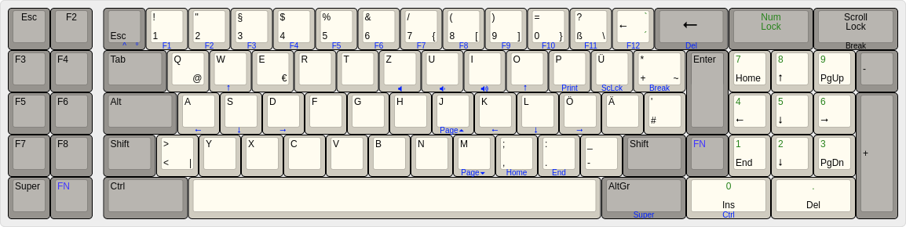

# Converter for IBM AT Model F

https://www.youtube.com/watch?v=uKOWVKJRFX8


Features:


## build and flash

```
sudo make clean converter/xt_usb:fehmer
```

## Layers

### Default (QWERTZ)




### FN


