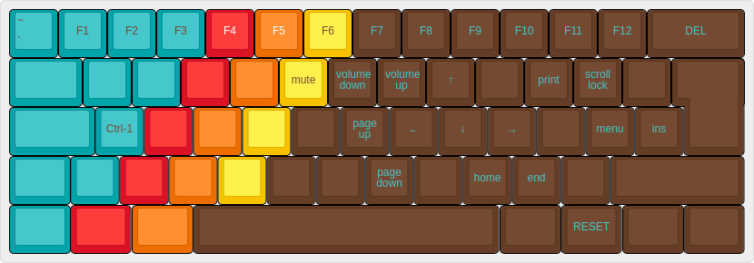
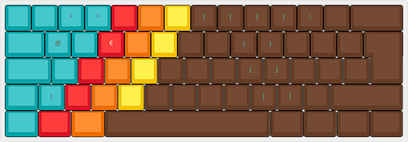

# DZ60 layout

Simplified layout based on German qwertz layout.

Features:

- dual function keys using double tab
    + double tab escape for caps-lock
- F-keys on the number keys
- Arrow keys on "oklö" on the function layer
- Access bootloader with left-FN and right-FN
- Easy access to `(),{},[]` on the Alt-Gr layer

## build and flash

```
sudo make dz60:fehmer:dfu
```

## Layers

### Default (QWERTZ)


### FN



### Alt-Gr

