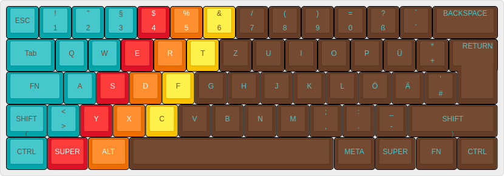
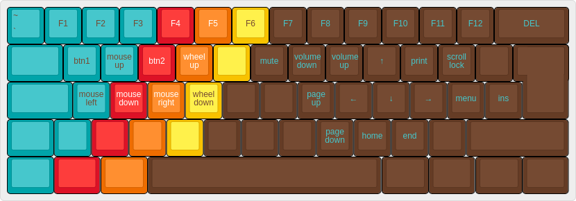

# Satan GH60 layout

Simplified layout based on German qwertz layout.

Features:

- one-shot modifiers(except shift). Allows to press keys after each other instead of simultaneous. E.g. `ctrl` and then `s` to save a file
- dual function keys using double tab
    + double tab escape for caps-lock
- F-keys on the number keys
- Arrow keys on "oklö" on the function layer
- Mouse support on "wasd"
- Access bootloader with left-FN and right-FN

## build and flash

```
sudo make gh60/satan:fehmer:dfu
```

## Layers

### Default (QWERTZ)




### FN



