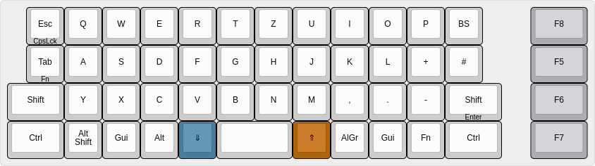
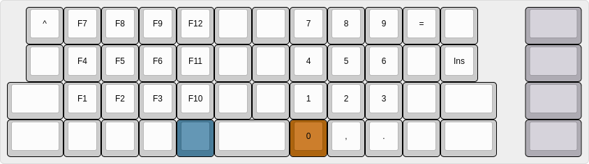
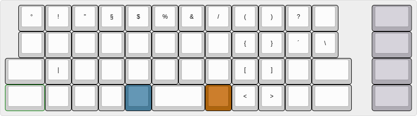
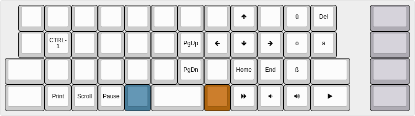
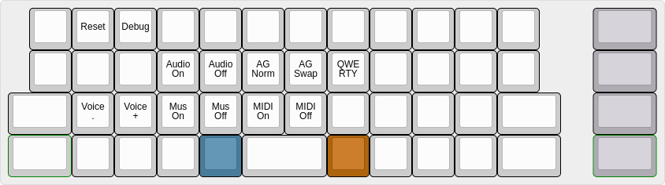

# Handwired Planck 64

Handwired Planck clone with extra function column on the right side.

## build and flash

```
sudo make handwired/planck64:fehmer:teensy
```


## Layers

### Default (QWERTZ)



### Lower



### Raise



### FN



### Adjust (lower+rise)



