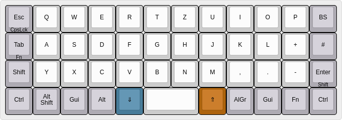
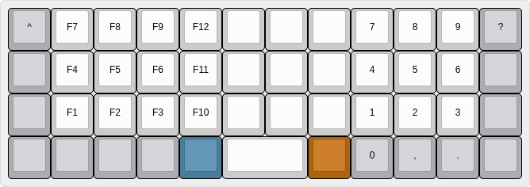
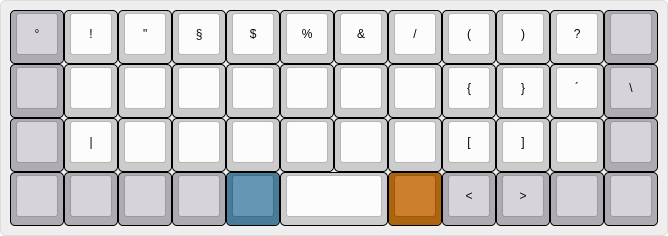
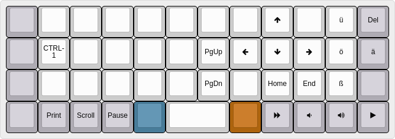
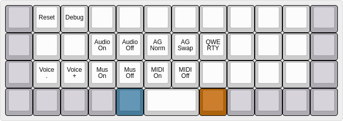

# My Planck Layout

Simplified layout based on german qwertz layout.

F-keys and and number-keys following the numpad-order with numbers on the right and f-keys on the left.

Arrow keys from the default layout are mapped to the traditional AltGr, Gui, FN, Ctrl layout. 

Other special keys are moved to the FN layer to be simmilar to the layout of my other keyboards. 


## build and flash

```
sudo make planck:rev6:fehmer:dfu-util
```

## Layers

### Default (QWERTZ)



### Lower



### Raise



### FN



### Adjust (lower+rise)




