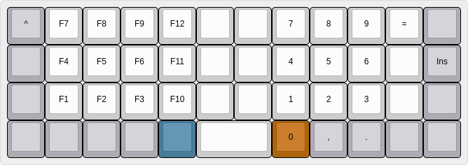

# My Planck Layout

Simplified layout based on German qwertz layout.

Features:

- one-shot modifiers(except shift). Allows to press keys after each other instead of simultaneous. E.g. `ctrl` and then `s` to save a file
- dual function keys using double tab
    + double tab escape for caps-lock
- dual function keys using hold
    + hold tab for the FN layer
    + hold enter for right shift
- extra keys
    + combined shift+alt key
    + ctrl+1 key
- F-keys and and number-keys following the numpad-order with numbers on the right and f-keys on the left.
- Arrow keys from the default layout are mapped to the traditional AltGr, Gui, FN, Ctrl layout.
- german special chars (umlaute) moved to FN-layer
- Other special keys are moved to the FN-layer to be similar to the layout of my other keyboards. 

## build and flash

```
sudo make planck/rev6:fehmer:dfu-util
```

## Layers

### Default (QWERTZ)


### Lower



### Raise


### FN


### Adjust (lower+rise)


